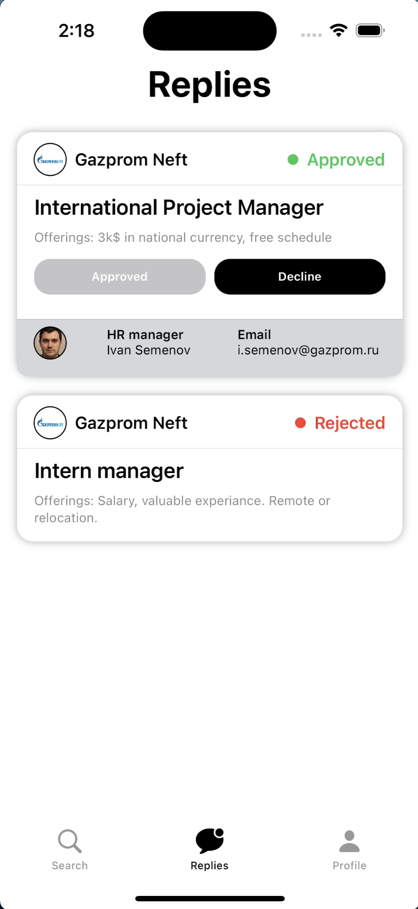

# **Brics Social App (iOS)**
### **Introduction:**
Application was developed as part of the team-project: **"Brics Social"**. The main goal is to facilitate job search and recruitment process in BRICS countries.
***

  
  
  

***
### **Functions:**
* You can swipe right to leave a request for the desired vacancy or left to skip irrelevant offer
* It's easy to search for a suitable offer by keywords or tags
* You can approve or reject offers from recruiters and track your requests easily on "Replies" tab
* Provide information about yourself and your professional skills to find a suitable offer faster!
***
### **Used frameworks and principles:**
* SwiftUI
* Clean Architechture
* Notification Center
* MVVM
* async/await
* Codable
* JWT-tokens
* KeyChain

***
## Target operating system
* IOS-16.0+
***